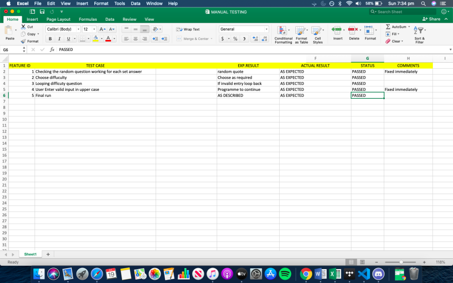

#                                           Minutes to Relax!!!

## Help File

### Dependencies:
 
* Python 3.8.3

#### How to install and start Application:

1. Extract files
2. cd Dhanyavittaldas_T1A3/src/
3. chmod +x main.py
4. ./main.py

#### Optional args:

--help : will print  helful tips if the user is stuck at any point during the game or if the user needs helps at the start of the game.
he user has the option to help by calling out the flag --h.

Once the user calls the --h code it will give the user with the below help tips and tricks if they are stuck anywhere in the application or if the want the help in the beginning of the game.

to run the programme system requires the applucatioTn Python 3 or higher version.

Lets play are you ready : enter either yes or no
difficulty : Choose easy, medium or Hard
exit : ctrl+Z
Questions: 5 on each set of difficulty
score: total score earned

### Starting the Minutes to Relax app :

* Start the Application
* Enter the name

#### Playing Minutes to Relax:
* Start the Application
* Enter name
* Answer to the are u ready qyestion
* Choose the Level of difficulty

### Purpose and Scope
The Purpose of the game Mitutes to relax is as described in the game name it will help the user to relax from what they are currently doing.
The user have to solve the riddle questions. Most of the riddle questions are funny ones so when they solve it , it is going to bring a simple
on their face. The game will start by asking the user to imput their name so the interaction during the game will be more of a custom interaction rather
than a general one. It is a single user game and can be played anytime without any timer. The reason for not using the timer is not to give any
stress for the user to answer it within a set time frame.

The game can be played anytime and will change the focus of the user. Many studies have found out that changing focus from the work we do for few Minutes
and taking some time to relax will improve our focus more when we go back to the work we were doing and that is what this game is trying to achieve.

### Features Of the Minutes to relax Application

* Personalised interaction :
  The game ask the user to input their name and this will be creting a personalised interaction using the user name .

* Starts with a motivational message :
  Once the user enters their name , the game will display a motivational message.
  

* No time restriction :
     User can play at their own time , No stress to answer the question within a time frame

* User has the option to choose difficulty :
  User has the option to choose which level of difficulty they need to play. There are three levels of difficuly. Easy , Medium and Hard. Each level of difficulty has 5 questions each
  

* Random motivational Quotes for correct output:
 Once the user enters their answer if the answer is correct the user will get a message which says " Your answer is correct " followed by a cheering quotes. The quotes will be printes random from the list.
 

* Random Motivational quotes for incorrect output :
 Once the user enters their answer if the answer is correct the user will get a message which says " Your answer is correct " followed by a motivational quotes. The quotes will be printes random from the list.
 

* Score displayes at the end of the game: 
  Once the user finish answering all the five questions , the game will print the score at the end and if the user has answered all the answers correct the game displays a ocongratulations message. If the user has atleast one question incorrect it is display a cheer up message.
  

* Continue to play option if required :
  Once the user has answered all the 5 questions in each level of difficulty the app gives the option for the user to continue the game . If user answers yes the game will restart the questions if not it will exit.

* sleep time :
  User is getting enough time to read the quote before the next question is displayed.

* --h sys argv :
   if the user wants help in using the app . All the help and tips is in the --h flag

* Error Handling : There are error handling codes added . Also if the user inputs the incorrect option it will let the user know that the input is incorrect and will ask the question again.

    

### User and Interaction

* Enter the player name : User can input thier name which is giving them the choice what to be called in the rest of the game.

* Enter the difficulty : The user is given the opportunity to choose the difficulty as required.

* Exit : User can always exit the game with ctl+z option. Which is also mentioned in the h flag

* Choice to continue : User can choose if they want to continue or not.

* User has the option to type the answer without any time constraint

* Time to read : User is getting the option to read before the next question gets displayed

### Control Flow Diagram :

The attached control flow diagram will help understand the flow of the app for each user selection. Ctrl+Z is from anywhere in the app and that is why it is left by itself

### Project Management

Developement in each stage was checked and error fixed accordingly.
Log was maintained for the performance check and analysis
Errors was fixed after each checking.
 below is the screenshot of one of the project management data.

 

### Implementation Playing

The application creation was very much planned and executed. There is a log that was followed. Requirements was broken down and time and day was assorted. Similar with testing the app and fixing the bugs. Necessary steps were taken to fix the common bugs and the application was tested by different users.
 entered is the excel sheet of the test performed and the result derived.
 Below is the  manual test sheet.
 

### Application testing

The application was tested several time to check if each features are implemented correctly and if it is according to the desired results.

Below screenshot is for the test when the user chooses option yes to begin :

Below is the screenshot is when the user chooses easy and answers the first question.

